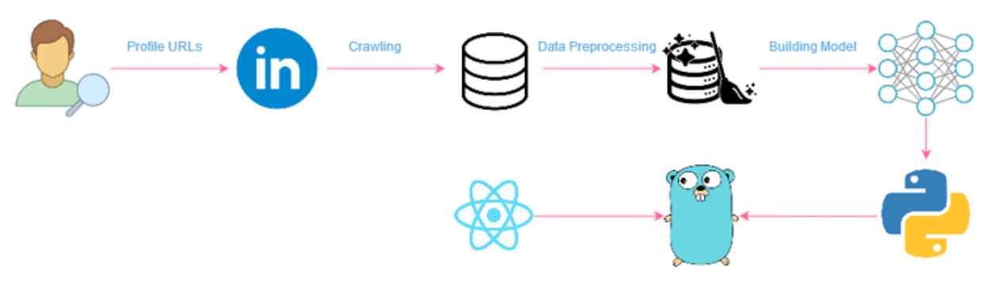

# Ajob Recommender

### Ajob Recommender is my bachelor thesis at Shahid Beheshti University.

      
      <caption>project strcuture</caption>

This image shows the project strcutute. 
Below, is the brief description about each phase.
  1. [Collecting Profile URLs](#collecting-profile-urls)
  2. [Crawling Profiles' Data](#crawling-profiles-data) 
  3. [Data Preprocessing](#data-preprocessing)
  4. [Building a machine learning model](#building-a-machine-learning-model)
  5. [Building a website for model](#building-a-website-for-model)

#### Collecting Profile URLs

In order to crawl profiles in linkedin, we need to collect the URLs of the profiles. The URLs are used in crawler then to crawl profiles.

#### Crawling Profiles' Data
For crawling profiles' data, we use crawler. A crawler is written in Selenium in python. Its source code is [here](https://github.com/AJob-Recommender/curly-linkedin).

#### Data Preprocessing
One of the challenges for data scientists is data preprocessing. In order to build a machine learning model, we need to form data to what we want and transform the dirty data to clean data. [This repository](https://github.com/AJob-Recommender/vacuum-cleaner) manages all things about data preprocessing.

#### Building a machine learning model
This phase is the ❤ of the project. It's a machine learning model which learns to predict the final job based on **skills**, **educations** and **experiences**. All phases are done for this part. the models used in this project are [here](https://github.com/AJob-Recommender/model)

#### Building a website for model
The final part is to build a website (Front-end + Back-end) which helps us to use our model. It contains 3 services.
- [PWA (front-end)](https://github.com/AJob-Recommender/pwa)
- [api-gateway (Back-end)](https://github.com/AJob-Recommender/api-gateway)
- [Wise (Backend)](https://github.com/AJob-Recommender/wise)